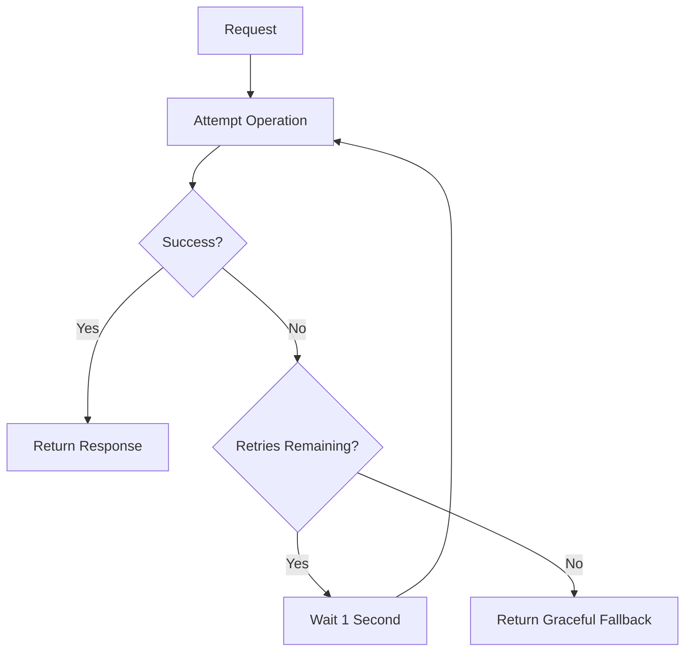

# Retry Logic Pattern

## Problem

Network calls, external APIs, and databases sometimes fail temporarily due to brief glitches. Failing immediately on the first error wastes a recoverable request.

## Solution

Retry Logic automatically re-attempts a failed operation a fixed number of times with a delay between attempts, before giving up and returning a fallback response.

## How it Works

Request comes in.

If it fails, wait 1 second and try again.

Retry up to 3 times total.

If all 3 attempts fail, return a graceful fallback message instead of crashing.

## Tech Stack

- Java 17
- Spring Boot 3.5.15
- Spring Retry
- Spring AOP
- Spring Boot Actuator

## How to Run

cd retry-logic

./mvnw spring-boot:run

## Test API

GET http://localhost:8080/api/retry/call

Check the console logs to see "Attempt #1", "Attempt #2" etc. as retries happen.

## When to Use

- Calling unreliable third-party APIs
- Database connections with intermittent network issues
- Any operation where failures are often transient, not permanent
