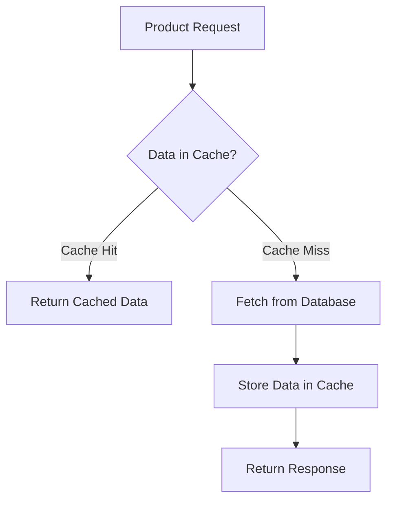

# Caching Pattern

## Problem

Every request hits the database — even for the same data requested 100 times.

This causes high DB load, slow response times, and poor user experience.

## Solution

Store frequently requested data in memory (cache). First request fetches from DB,

subsequent requests return instantly from cache — no DB hit.

## How it Works

1. Request comes in for a product
2. Check cache — if data exists (cache hit) → return instantly
3. If not in cache (cache miss) → fetch from DB, store in cache, return response
4. Next request for same data → served from cache in milliseconds



## Tech Stack

- Java 17
- Spring Boot 3.5.x
- Spring Cache (@Cacheable)
- Spring Boot Actuator

## How to Run

```bash
cd 05-caching
./mvnw spring-boot:run
```

## Test API

```bash
# First request - slow (hits DB, ~3 seconds)
curl http://localhost:8080/api/products/1

# Second request - instant (served from cache, ~2ms)
curl http://localhost:8080/api/products/1
```

## When to Use

- Product catalogs
- User profile data
- Any data that is read frequently but changes rarely

## When NOT to Use

- Real-time data (stock prices, live scores)
- User-specific sensitive data
- Data that changes very frequently
