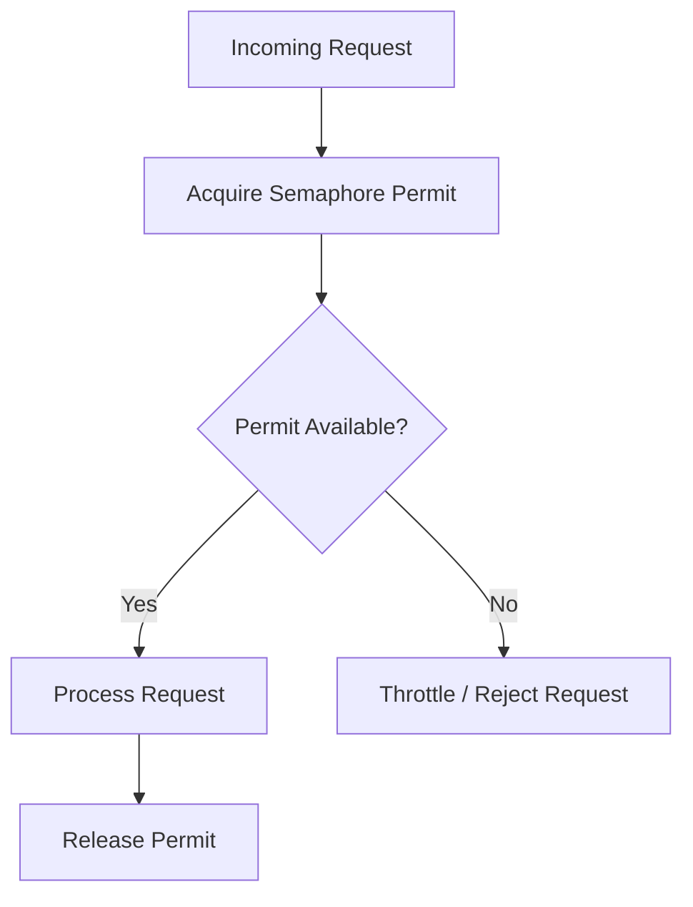

# Throttling Pattern

## Problem

Multiple concurrent requests from the same user can overwhelm your service.

Unlike Rate Limiting (which blocks after X requests per minute), 

some services need to limit concurrent connections per user.

## Solution

Throttling controls how many concurrent requests a single user can make.

Extra requests are queued or rejected gracefully instead of crashing the server.

## How it Works

1. Each user gets a Semaphore with max 3 permits
2. Every request acquires 1 permit before processing
3. If all 3 permits are taken → request is THROTTLED
4. After processing completes → permit is released for next request



## Throttling vs Rate Limiting

| | Rate Limiting | Throttling |
|---|---|---|
| Controls | Requests per time window | Concurrent requests |
| Rejected after | X requests per minute | X simultaneous connections |
| Use case | API abuse prevention | Concurrency control |

## Tech Stack

- Java 17
- Spring Boot 3.5.x
- Java Semaphore
- Spring Boot Actuator

## How to Run

```bash
cd 08-throttling
./mvnw spring-boot:run
```

## Test API

```bash
curl "http://localhost:8080/api/process?userId=user1"
```

## When to Use

- Limiting concurrent DB connections per user
- File upload/download concurrency control
- Preventing single user from monopolizing resources

## When NOT to Use

- When you need time-based limits (use Rate Limiting instead)
- Simple single-user applications
