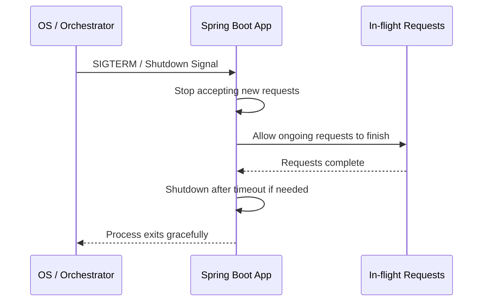

# Graceful Shutdown Pattern

## Problem

When a service restarts or scales down, ongoing requests get abruptly 

cut off — causing failed transactions, partial writes, and unhappy users.

## Solution

Configure the server to stop accepting new requests during shutdown, 

but let in-flight requests finish before the process exits.

## How it Works

1. Shutdown signal received (SIGTERM in production, Ctrl+C locally)
2. Server stops accepting new incoming requests
3. Ongoing requests are allowed to complete (up to a configured timeout)
4. Once all requests finish (or timeout expires) — server shuts down



## Tech Stack

- Java 17
- Spring Boot 3.5.x
- Spring Boot Actuator

## How to Run

```bash
cd 09-graceful-shutdown
./mvnw spring-boot:run
```

## Test It

```bash
# Start a long-running request
curl http://localhost:8080/api/long-task
```

While the request is in progress, press `Ctrl+C` in the terminal running the app.

Notice the request completes before the app fully shuts down.

## Configuration

```properties
server.shutdown=graceful
spring.lifecycle.timeout-per-shutdown-phase=30s
```

## When to Use

- Any production service behind a load balancer
- Kubernetes deployments (pairs well with readiness probes)
- Services handling payments, orders, or file uploads

## When NOT to Use

- Local development/testing where instant restarts are preferred
